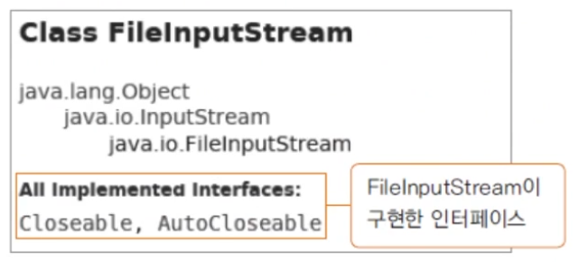

# 예외 처리하기와 미루기

## try-catch 문

- try 블록에는 예외가 발생할 가능성이 있는 코드를 작성하고 try 블록 안에서 예외가 발생하는 경우 catch 블록이 수행됨.

```java
try {
    예외가 발생할 수 있는 코드 부분
} catch(처리할 예외 타입 e) {
    try 블록 안에서 예외가 발생했을 때 예외를 처리하는 부분
}
```

- 프로그래머가 예외를 처리해 줘야 하는 예 (배열의 오류 처리)

```java
public class ArrayIndexException2 {
    public static void main(String[] args) {
        int[] arr = {1, 2, 3, 4, 5};

        try {
            for (int i = 0; i <= 5; i++) { // index 5가 없기 때문에 오류가 남.
                System.out.println(arr[i]);
            }
        } catch (ArrayIndexOutOfBoundsException e) { // ArrayIndexOutOfBoundsException 클래스를 활용
            System.out.println(e.getMessage());
            System.out.println(e);
        }

        System.out.println("here"); // 예외 처리를 했기 때문에 해당 출력문은 출력이 된다.

        // 결과
        // 1
        // 2
        // 3
        // 4
        // 5
        // Index 5 out of bounds for length 5
        // java.lang.ArrayIndexOutOfBoundsException: Index 5 out of bounds for length 5
        // here
    }
}
```

## try-catch-finally 문

- finally 블록에서 파일을 닫거나 네트워크를 닫는 등의 리소스 해제 구현을 함.
- try{} 블록이 수행되는 경우, finally{} 블록은 항상 수행됨.
- 여러 개의 예외 블록이 있는 경우 각각에서 리소스를 해제하지 않고 finally 블록에서 해제하도록 구현함.
- 컴파일러에 의해 예외가 처리되는 예 (파일 에러 처리)

```java
import java.io.FileInputStream;
import java.io.FileNotFoundException;
import java.io.IOException;

public class FileExceptionHandling {
    public static void main(String[] args) {
        FileInputStream fis = null;

        try {
            fis = new FileInputStream("a.txt");
            System.out.println("read");

            try {
                fis.close();
            } catch (IOException e) {
                e.printStackTrace();
            }

        } catch (FileNotFoundException e) {
            System.out.println(e);

            try {
                fis.close();
            } catch (IOException e2) {
                e2.printStackTrace();
            }
        }

        System.out.println("end");

        // 결과
        // java.io.FileNotFoundException: a.txt (그런 파일이나 디렉터리가 없습니다)
        // Exception in thread "main" java.lang.NullPointerException: Cannot invoke "java.io.FileInputStream.close()" because "fis" is null
        //	 at FileExceptionHandling.main(FileExceptionHandling.java:23)
    }
}
```

## try-with-resources문

- 리소스를 사용하는 경우 close() 하지 않아도 자동으로 해제되도록 함.
- java 7부터 제공되는 구문
- 리소스를 try() 내부에 선언해야만 함.
- close()를 명시적으로 호출하지 않아도 try{} 블록에서 열린 리소스는 정상적인 경우나 예외가 발생한 경우 모두 자동으로 해제됨.
- 해당 리소스 클래스가 AutoCloseable 인터페이스를 구현해야 함.
- FileInputStream의 경우에는 AutoCloseable을 구현하고 있음.
- java 9부터 리소스는 try() 외부에서 선언하고 변수만을 try(obj)와 같이 사용할 수 있음.



- AutoCloseable 인터페이스 구현 실습

```java
public class AutoCloseableObj implements AutoCloseable {
    @Override
    public void close() throws Exception {
        System.out.println("closing...");
    }
}
```

```java
public class AutoCloseTest {
    public static void main(String[] args) {
        AutoCloseableObj obj = new AutoCloseableObj();

        try (obj) {
            // AutoCloseable을 구현한 클래스인 AutoCloseableObj가 잘 불리는지 확인
            // closing...

            // 강제로 exception 발생
            throw new Exception();
        } catch (Exception e) {
            System.out.println("exception");
        }

        System.out.println("end");

        // 결과
        // closing...
        // exception
        // end
    }
}
```

## 예외 처리 미루기

- 예외 처리는 예외가 발생하는 문장에서 try-catch 블록으로 처리하는 방법과 이를 사용하는 부분에서 처리하는 방법 두 가지가 있음.
- throws를 이용하면 예외가 발생할 수 있는 부분을 사용하는 문장에서 예외를 처리할 수 있음.

## 하나의 try{} 블록에서 예외가 여러 개 발생하는 경우

- 여러 개의 예외가 발생하는 경우 예외를 묶어서 하나의 방법으로 처리할 수도 있고,

```java
try {
    test.loadClass("a2.txt", "java.lang.Stringgggggg");
} catch (FileNotFoundException | ClassNotFoundException e) { // 여러 개의 예외가 발생하는 경우 예외들을 묶어서 하나의 방법으로 처리
    System.out.println(e);
} catch (Exception e) {
    System.out.println(e);
}
```

- 각각의 예외를 따로 처리할 수도 있음

```java
try {
    test.loadClass("a2.txt", "java.lang.Stringgggggg");
} catch (FileNotFoundException e) {
    System.out.println(e);
} catch (ClassNotFoundException e) {
    System.out.println(e);
} catch (Exception e) { // 위 두 개의 exception 처리 말고도 어떤 오류가 발생될지 모를 때에는 Exception가 최상위 클래스이기 때문에 Exception 클래스로 받아서 처리하여도 된다.
    System.out.println(e);
}
```

- Exception 클래스를 활용하여 default 처리를 할 때 Exception 블록은 맨 마지막에 위치해야 함.